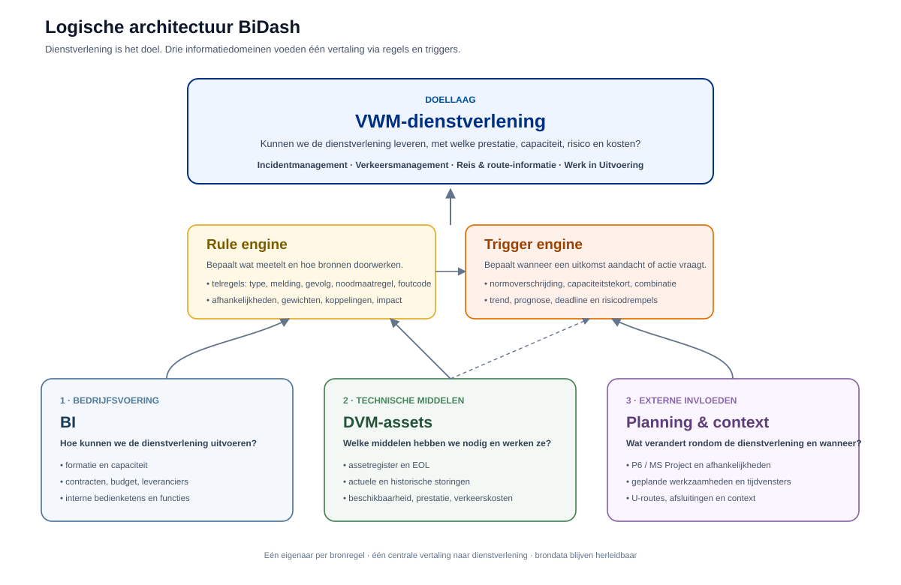

# Logische architectuur

BiDash heeft twee nuttige architectuurbeelden die niet hetzelfde doel hebben. Het eerste beschrijft de inhoudelijke denkwijze: welke factoren beïnvloeden de VWM-dienstverlening. Het tweede beschrijft de technische implementatie: schil, kern, adapters en bestaande modules.

## Inhoudelijke denkwijze: dienstverlening bovenaan

De bovenste laag is bewust niet BI, DVM of Planning maar de dienstverlening zelf. De centrale vraag is: kunnen we Incidentmanagement, Verkeersmanagement, Reis- en route-informatie en Werk in Uitvoering nu en straks leveren, en met welke prestatie, capaciteit, risico en kosten?

Daaronder staan drie informatiedomeinen naast elkaar.

### Bedrijfsvoering / BI

BI beschrijft hoe de organisatie de dienstverlening kan uitvoeren. Daar horen formatie, beschikbare capaciteit, contracten, budget, leveranciers, functies en interne bedienketens bij.

De naam Business Intelligence is breder dan de huidige inhoud. In deze logische architectuur betekent BI daarom vooral de bedrijfsvoerings- en uitvoeringsvermogensblik: hebben we organisatorisch voldoende vermogen om de dienst te leveren?

### Technische middelen / DVM-assets

DVM is als naam historisch gegroeid en dekt dit domein niet volledig. Logisch gaat deze laag over de technische middelen die nodig zijn om de diensten te kunnen leveren: assetregister, areaal, EOL, actuele en historische storingen, technische beschikbaarheid, prestatie, prognoses en assetgerelateerde verkeerskosten.

Een toekomstige gebruikersnaam als `Technische middelen` of `Assets & techniek` beschrijft de inhoud daarom beter dan alleen DVM. De bestaande code hoeft daarvoor niet direct te worden hernoemd.

### Planning en externe invloeden

Planning beschrijft wat rondom de dienstverlening verandert en wanneer. Daaronder vallen P6- en MS Project-activiteiten, afhankelijkheden, werkzaamheden, tijdvensters, U-routes, afsluitingen en vergelijkbare tijdgebonden context.

Planning is daarmee geen vierde dienstmodel, maar een bron van externe invloed en uitvoerbaarheidscontext.

## Rule engine en trigger engine

De rule engine vertaalt gegevens uit de drie domeinen naar betekenis voor de dienstverlening. Hier horen regels thuis die bepalen welke bronregels meetellen, welke assets, functies en subprocessen worden geraakt, welke gewichten gelden en welke expliciete koppelingen bestaan.

Het configureerbare filter voor actuele open storingen hoort hier conceptueel bij. De volledige storingsmomentopname blijft de bronwaarheid voor A-B-vergelijking en historisering. Alleen de geselecteerde meldingen gaan door naar de actuele impactberekening. Daarmee blijft `bronfeit` gescheiden van `wat telt mee in de dienstberekening`.

De trigger engine komt daarna. Die bepaalt wanneer een berekende toestand aandacht of actie vraagt, bijvoorbeeld bij dienstverlening onder norm, capaciteitstekort, samenloop van technische uitval en personele krapte, een kostendrempel of een prognose die binnen een ingestelde termijn een grens passeert.

Rule engine en trigger engine zijn dus niet hetzelfde: de rule engine bepaalt betekenis en doorwerking; de trigger engine bepaalt wanneer de uitkomst een signaal of besluitmoment wordt.

## Waarom BI niet letterlijk boven DVM en Planning staat

De gedachte om BI boven DVM en Planning te tekenen is inhoudelijk begrijpelijk, omdat BI antwoord geeft op de vraag hoe de organisatie de dienstverlening kan uitvoeren. Toch is het zuiverder om Bedrijfsvoering, Technische middelen en Planning naast elkaar te plaatsen.

Anders zou de tekening suggereren dat BI eigenaar is van technische assetfeiten of van externe planningsfeiten. Dat is niet de bedoeling. De echte bovenliggende laag is de dienstverlening. Alle drie domeinen leveren zelfstandig informatie aan de centrale vertaling naar die dienstverlening.

## Technische implementatie

De inhoudelijke architectuur hierboven verandert niet automatisch de huidige code-indeling. BiDash is technisch nog steeds een gezamenlijke werkruimte rond drie bestaande applicaties met een eigen DOM, globale variabelen en rekenfuncties. Onderstaande tekening blijft daarom belangrijk voor onderhoud en wijzigingen.

De normatieve technische beschrijving staat in [SYSTEEMWERKING.md, hoofdstuk 2](SYSTEEMWERKING.md#2-architectuur-en-eigenaarschap). Wijkt een tekening af van de code, dan heeft de code gelijk en moeten documentatie en tekening worden bijgewerkt.

### A · Schil

De schil is wat de gebruiker ziet: schermen, hoofdmenu, navigatie en de orchestratie van importeren, herstellen, opslaan en tonen. De schil rekent geen domeinregels uit. Hij vraagt op, ontvangt samenvattingen en zet ze naast elkaar; wat hij optelt is een weergavetotaal, geen nieuwe norm.

### B · Kern

De kern bevat de afspraken die alle partijen delen: wat een geldig bestand is, welke delen een import vervangt, wat een export meeneemt, hoe opeenvolgende storingslijsten zich tot elkaar verhouden, en hoe losse signalen tot één lijst worden samengevoegd. Dit is juist niet de plek om nieuwe domeinregels neer te zetten.

### C · Bruggen

De adapters vormen het expliciete luik via `window.HUB`. De schil kent het binnenwerk van een module niet en mag er niet omheen grijpen.

De drie luiken zijn niet even breed. `dvm-adapter.js` en `bi-adapter.js` dragen onder andere `import`, `export` en `summary`. Planning heeft een beperktere adapter en ontvangt formatieregels expliciet vanuit BI. Dat is technische implementatie en staat los van het inhoudelijke feit dat Planning in de logische architectuur een eigen invloeddomein is.

### D · Modules

De oorspronkelijke applicaties draaien elk in een eigen `iframe`. Hier zit de meeste domeinkennis en hier ligt het technische eigenaarschap van de bestaande rekenfuncties. Het live-overzichtsfilter voor storingen wordt daarom technisch binnen de DVM-route toegepast, terwijl de gedeelde snapshotlogica de volledige momentopnamen intact bewaart.

## Eén eigenaar per rekenregel

Dit blijft het dragende principe. DVM bezit de technische assetimpact, de selectie van storingen die voor het actuele technische beeld meetellen en verkeerskosten. BI bezit formatienormen, contracten en interne bedienketens. Planning bezit het XML-model en de planningafhankelijkheden en past expliciet aangeleverde formatieregels toe zonder ze te herdefiniëren.

De gezamenlijke schil combineert uitkomsten en expliciete koppelingen. Hij introduceert geen tweede dienst-, kosten- of formatiemodel. De logische rule engine mag daarom als concept centraal staan zonder dat alle regels technisch naar één nieuw bestand worden verplaatst.

## Drie grenzen, en maar één daarvan is een beveiligingsgrens

De technische tekening bevat drie soorten scheiding die niet door elkaar moeten worden gehaald.

De netwerkgrens is echt. De gestippelde rand is de browser. De Content Security Policy met `connect-src 'none'` betekent dat de applicatie geen netwerkverzoek voor brondata kan doen. Er is geen upload, geen accountopslag en geen telemetrie. GitHub levert de applicatie; de gegevens blijven aan deze kant van de rand.

De eigenaarsgrens is een afspraak. Niets in de techniek verhindert dat iemand een dienstnorm in de schil programmeert. Review, tests en documentatie moeten voorkomen dat één rekenregel op twee plaatsen ontstaat.

De framegrens is functioneel, geen beveiligingsgrens. De modules draaien in `iframe`s met `allow-scripts` en `allow-same-origin`, op dezelfde origin als de schil. Dat isoleert DOM en globale variabelen, maar beschermt niet tegen kwaadaardige eigen code. `postMessage` wordt daarom alleen verwerkt voor dezelfde origin én een bekend bronframe.

## Opslag zit aan het apparaat vast

De schil schrijft de volledige werkruimte naar IndexedDB, database `bidash-integraal`, objectstore `workspace`, sleutel `current`. De modules gebruiken daarnaast hun eigen lokale browseropslag voor instellingen.

Beide zijn gebonden aan deze browser op dit apparaat. Browseropslag is geen back-up. Een export is de overdraagbare vorm. Gebruik één werkruimte-tab tegelijk; er is geen uitgewerkte meergebruikerssynchronisatie.

## Wat de tekeningen niet zeggen

Ze valideren niet de verkeerskundige of statistische modellen. Een nette laagindeling is geen bewijs dat een formule inhoudelijk correct is.

Ook tonen ze niet iedere detailroute. De actuele storingsfilterflow is apart vastgelegd in `processflow.md` en `afbeeldingen/storingsfilter-flow.svg`, omdat die uitlegt hoe de onbewerkte bronmomentopname en de gefilterde actuele rekenstroom naast elkaar bestaan.

## Waar je moet zijn bij een wijziging

Bepaal eerst welk inhoudelijk domein eigenaar is en daarna welke technische laag geraakt wordt. Een technische modulewijziging raakt de regels van één eigenaar. Een wijziging in de gedeelde kern raakt het gegevenscontract van iedereen en vraagt compatibiliteits- en deelimportcontroles. Een wijziging in adapters raakt de afspraak tussen modules.

De verplichte werkwijze en testmatrix staan in [SYSTEEMWERKING.md, hoofdstuk 11 en 12](SYSTEEMWERKING.md#11-verplichte-werkwijze-bij-ai-wijzigingen).
