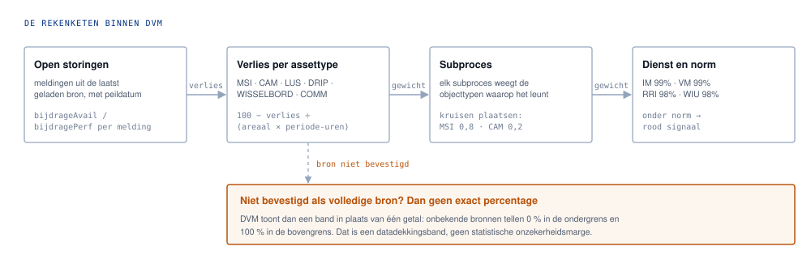

# Processflow van BiDash

BiDash voegt twee bestaande rekenwerelden samen, dienstimpact en kosten uit DVM, planning, formatie en contracten uit BI, zonder dat een van beide zijn eigen regels afstaat. Alles rekent in de browser van de gebruiker. Er gaat geen bronbestand het apparaat af.

## 1. De app en documentatie komen van GitHub, de gegevens nooit

De workflow publiceert de map `site/` naar GitHub Pages. Vóór het publicatie-artifact wordt gemaakt voert de teststap `scripts/stage-docs.mjs` uit. Die kopieert de repositorydocumentatie naar `site/docs/` en maakt `site/help-docs.js` uit de echte Markdown-bestanden. Deze twee paden zijn gegenereerd en worden niet in Git opgeslagen.

Wat de gebruiker ophaalt zijn dus alleen statische applicatiebestanden, uitleg en afbeeldingen. Operationele bronbestanden worden nooit onderdeel van die publicatie. De hoofdapp behoudt een Content Security Policy met `connect-src 'none'`; de Help-viewer heeft geen fetch of externe Markdown-service nodig, omdat de Markdown tijdens publicatie lokaal in de Help-bundel is opgenomen.

## 2. Je kiest bestanden en ziet eerst wat er verandert

Onder Laden en exporteren kies je een DVM-totaal-JSON, een integrale BiDash-bundel, een BI Dash-JSON of een planning-XML uit Primavera P6 of MS Project. Voordat er iets verandert draait `validate()` over de inhoud. Objectsleutels als `__proto__` worden geweigerd en te diep geneste bestanden afgebroken. Daarna krijg je een lijst van precies die onderdelen die vervangen gaan worden. Alles wat het bestand niet meelevert blijft staan. Mislukt de import halverwege, dan blijft de vorige opgeslagen werkruimte behouden en moet de pagina worden herladen om de opgeslagen toestand terug te zetten.

Specialistische DVM-bronnen, zoals All Assets, EOL, historische storingen, open storingen, U-routes en werkzaamheden, laad je via DVM-bronbeheer.

## 3. Actuele storingslijst is een vervangende momentopname

De invoer Open storingen accepteert XLSX, XLS en CSV met herkenbare DVM-storingsregels. Deze lijst is geen extra historische bron. De nieuwe lijst vervangt de vorige actuele momentopname volledig, ook als de bestandsnaam anders is.

BiDash vergelijkt de vorige actuele lijst A met de nieuwe lijst B. Een event-id heeft voorrang als stabiele identiteit. Als die ontbreekt wordt een combinatie gebruikt van asset, starttijd, weg, richting, hectometer, strook, foutcode, melding en gevolg.

| Vergelijking | Uitkomst |
| --- | --- |
| Storing staat in A en B | Blijft actueel open |
| Storing staat alleen in B | Nieuwe actuele open storing |
| MSI-storing staat in A maar ontbreekt in B | Afsluiten op de peildatum van B en toevoegen aan storingshistorie |
| Afgesloten storing bestaat al in historie | Niet opnieuw toevoegen |

De actuele dashboards gebruiken daarna alleen lijst B. Automatisch afgesloten MSI-storingen gaan alleen naar de historische stroom en kunnen daardoor wel bijdragen aan historische analyse en prognosekalibratie, maar niet aan het actuele prestatiebeeld.

## 4. De engines rekenen apart door

De oorspronkelijke applicaties draaien elk in een eigen sandboxed `iframe`. Ze praten met de schil via `window.HUB`, met functies voor import, export, samenvatting en openen van verdiepende schermen. De schil kent hun binnenwerk niet en herrekent de domeinregels niet zelf.

DVM blijft eigenaar van storingsimpact, assetafhankelijkheden, subprocessen, dienstnormen, verkeersscenario's en tarieven. BI blijft eigenaar van formatie, contracten, budget, bedienketens en planningscapaciteit. De oude BI-storingsimport is bewust stilgezet, zodat dezelfde storing niet twee keer meetelt.

## 5. Samenhang ontstaat alleen waar jij die legt

BI-signalen worden ongewijzigd doorgegeven. Een DVM-dienst onder zijn eigen norm levert een eigen signaal. Het gecombineerde signaal, dienstimpact en capaciteitstekort in één melding, ontstaat uitsluitend wanneer in Regels en koppelingen is vastgelegd welke bedrijfsfunctie verantwoordelijk is voor welke dienst. BiDash leidt zo'n verband nooit af uit een gelijkende naam.

## 6. Lokaal bewaren, zelf samenstellen wat je meeneemt

Zodra een engine iets wijzigt stuurt die een bericht naar de schil. Na ongeveer anderhalve seconde rust schrijft de schil de volledige staat naar IndexedDB, onder de naam `bidash-integraal`. Bij het herladen wordt diezelfde staat teruggeduwd in de engines, inclusief de planning-XML.

Die opslag zit aan dit apparaat en deze browser vast. Wis je browsergegevens, dan is de kopie weg. Export is daarom de aangewezen route voor overdracht en back-up.

## 7. Gebruikershulp toont de echte Markdown-documentatie

Rechtsboven in BiDash staat een Help-knop. Die opent `site/help.html`. De pagina bevat alleen de viewer en navigatie. De inhoud zelf komt tijdens iedere test/publicatie opnieuw uit de bestanden in `docs/`.

De standaardweergave is deze processflow. Alle Markdown-bestanden op het hoogste niveau van `docs/` verschijnen automatisch in de documentnavigatie. Afbeeldingen en SVG's blijven via hun relatieve Markdown-paden gekoppeld en worden vanuit `site/docs/` getoond. Daardoor is er geen aparte HTML-kopie van de gebruikersuitleg meer die handmatig gelijk moet worden gehouden.

Bij functionele wijzigingen aan bediening, gegevensstromen, opslag, export of rekenketens worden de relevante `.md`-bestanden en afbeeldingen bijgewerkt. Een wijziging onder `docs/**` activeert ook de Pages-workflow, zodat Help opnieuw wordt opgebouwd en gepubliceerd.

## Wat het systeem bewust niet doet

| Grens | Waarom |
|---|---|
| Geen data naar buiten | Geen upload, geen accountopslag en geen synchronisatie. Bronbestanden horen ook nooit in de repository. |
| Geen afgeleide koppelingen | Een dienst en een bedrijfsfunctie worden nooit aan elkaar gekoppeld omdat ze op elkaar lijken. |
| Geen opgetelde bedragen | Verkeerskosten, contractkosten en capaciteit houden hun eigen betekenis. Onbekende kosten verschijnen als onbekend, nooit als nul. |
| Geen verborgen onzekerheid | Is de dekking van een storingsbron niet bevestigd, dan volgt een band in plaats van een exact percentage. |

## Waar elk stuk in de code zit

| Bestand | Verantwoordelijkheid |
|---|---|
| [`site/index.html`](../site/index.html) | De schil met de schermen, Help-knop en de Content Security Policy |
| [`site/help.html`](../site/help.html) | De gepubliceerde Help-shell en documentnavigatie |
| [`site/help.js`](../site/help.js) | Selecteren en tonen van de gebundelde Markdown-documenten |
| [`site/core/markdown.js`](../site/core/markdown.js) | Lokale Markdown-rendering, tabellen, links en relatieve afbeeldingspaden |
| [`scripts/stage-docs.mjs`](../scripts/stage-docs.mjs) | Bundelt `docs/` en genereert de Help-documenten voor test/publicatie |
| [`site/app.js`](../site/app.js) | Import met voorvertoning, staat ophalen, opslaan, tekenen en exporteren |
| [`site/core/model.js`](../site/core/model.js) | Validatie, samenvoegen, exportselectie en `combine()` |
| [`site/core/storage.js`](../site/core/storage.js) | Lezen en schrijven van de werkruimte in IndexedDB |
| [`site/core/live-snapshot.js`](../site/core/live-snapshot.js) | Synchronisatie tussen opeenvolgende open-storingenmomentopnamen en historisering van verdwenen MSI-storingen |
| [`site/core/signal-forecast.js`](../site/core/signal-forecast.js) | De signaalgeverprognose en de WIS-berekening |
| [`site/engines/dvm-*.js`](../site/engines) | De DVM-engine, diensten, subprocessen, assetimpact en tarieven |
| [`site/engines/bi-*.js`](../site/engines) | De BI-engine, formatie, financiën, contracten en bedienketens |
| [`site/engines/planning.html`](../site/engines/planning.html) | De planningstool die P6- en MS Project-XML leest |
| [`site/engines/*-adapter.js`](../site/engines) | Het luik `window.HUB` tussen engine en schil |
