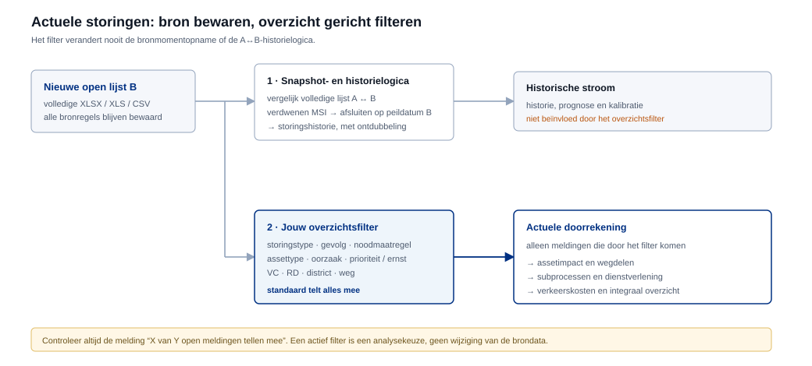
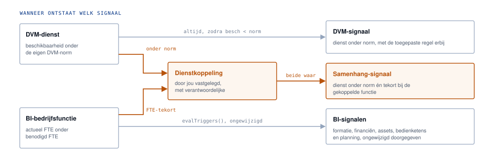

# Processflow van BiDash

BiDash brengt drie informatiedomeinen samen rond één doel: de VWM-dienstverlening. Bedrijfsvoering beschrijft of de organisatie de dienst kan uitvoeren, technische middelen beschrijven of de benodigde assets beschikbaar zijn en planning/context beschrijft externe en tijdgebonden invloeden. Rule engine en trigger engine vertalen die bronnen naar dienstimpact, signalen en besluitinformatie. Alles rekent in de browser van de gebruiker. Er gaat geen bronbestand het apparaat af.

De inhoudelijke denkwijze staat ook in de [logische architectuur](architectuur.md).

## 1. De app en documentatie komen van GitHub, de gegevens nooit

De workflow publiceert de map `site/` naar GitHub Pages. Vóór het publicatie-artifact wordt gemaakt voert de teststap `scripts/stage-docs.mjs` uit. Die kopieert de repositorydocumentatie naar `site/docs/` en maakt `site/help-docs.js` uit de echte Markdown-bestanden. Deze twee paden zijn gegenereerd en worden niet in Git opgeslagen.

Wat de gebruiker ophaalt zijn dus alleen statische applicatiebestanden, uitleg en afbeeldingen. Operationele bronbestanden worden nooit onderdeel van die publicatie. De hoofdapp behoudt een Content Security Policy met `connect-src 'none'`; de Help-viewer heeft geen fetch of externe Markdown-service nodig, omdat de Markdown tijdens publicatie lokaal in de Help-bundel is opgenomen.

## 2. Je kiest bestanden en ziet eerst wat er verandert

Onder Laden en exporteren kies je een DVM-totaal-JSON, een integrale BiDash-bundel, een BI Dash-JSON of een planning-XML uit Primavera P6 of MS Project. Voordat er iets verandert draait `validate()` over de inhoud. Objectsleutels als `__proto__` worden geweigerd en te diep geneste bestanden afgebroken. Daarna krijg je een lijst van precies die onderdelen die vervangen gaan worden. Alles wat het bestand niet meelevert blijft staan. Mislukt de import halverwege, dan blijft de vorige opgeslagen werkruimte behouden en moet de pagina worden herladen om de opgeslagen toestand terug te zetten.

Tijdens deze stap toont de hoofdapp een voortgangsbalk onder de statusregel. Voor bestanden die via **Data & export** worden gekozen, wordt de leesfase gemeten met `FileReader` en echte bytevoortgang. Zodra het lezen klaar is krijgt de browser eerst gelegenheid de status te tekenen voordat JSON- of XML-parsing begint. Zware parsing kan de hoofdthread nog kort blokkeren; de voortgang kan dan tijdelijk stilstaan zonder dat dit betekent dat het proces is afgebroken.

Specialistische technische bronnen, zoals All Assets, EOL, historische storingen, open storingen, U-routes en werkzaamheden, laad je via DVM-bronbeheer. De bestaande DVM-importfasen en percentages worden via `hub:import-progress` ook naar dezelfde voortgangsbalk in de hoofdapp gestuurd. Daardoor ziet de gebruiker één doorlopende importstatus voor zowel de hub-import als de specialistische DVM-bronnen.

## 3. Actuele storingslijst is een vervangende momentopname

De invoer Open storingen accepteert XLSX, XLS en CSV met herkenbare storingsregels. Deze lijst is geen extra historische bron. De nieuwe lijst vervangt de vorige actuele momentopname volledig, ook als de bestandsnaam anders is.

BiDash vergelijkt de vorige actuele lijst A met de nieuwe lijst B. Een event-id heeft voorrang als stabiele identiteit. Als die ontbreekt wordt een combinatie gebruikt van asset, starttijd, weg, richting, hectometer, strook, foutcode, melding en gevolg.

| Vergelijking | Uitkomst |
| --- | --- |
| Storing staat in A en B | Blijft actueel open |
| Storing staat alleen in B | Nieuwe actuele open storing |
| MSI-storing staat in A maar ontbreekt in B | Afsluiten op de peildatum van B en toevoegen aan storingshistorie. De duur die daaruit volgt is een bovengrens en telt niet mee in de herstelduurstatistiek |
| Afgesloten storing bestaat al in historie | Niet opnieuw toevoegen |

De volledige lijst B blijft de actuele bronmomentopname. Automatisch afgesloten MSI-storingen gaan alleen naar de historische stroom en kunnen daardoor wel bijdragen aan historische analyse en prognosekalibratie, maar niet aan het actuele prestatiebeeld.

## 4. De gebruiker bepaalt wat van lijst B meetelt in het actuele overzicht

De bronmomentopname en de selectie voor de actuele doorrekening zijn bewust twee verschillende dingen. Nadat lijst B volledig is opgeslagen, kan de gebruiker in Datasetbeheer een filter instellen. Dat filter bepaalt alleen welke open bronregels doorstromen naar actuele assetimpact, wegdelen, subprocessen, dienstverlening en verkeerskosten.

Het filter kan waarden uitsluiten op storingstype of foutregel, gevolg, noodmaatregel, assettype, oorzaak, prioriteit of ernst, verkeerscentrale, regionale dienst, district en weg. Binnen één groep kunnen meerdere waarden meetellen; tussen groepen gelden de voorwaarden gezamenlijk. Een leeg bronveld is een expliciete waarde `(geen waarde)` en kan dus ook worden uitgesloten.

Iedere wijziging aan een vinkje wordt automatisch na een korte debounce op de actuele DVM-doorrekening toegepast. Er is geen aparte bevestigingsstap meer nodig. De knop onder de filterkaart is alleen nog bedoeld om naar het dienstoverzicht te navigeren.

De configuratie slaat alleen uitgesloten waarden op. Een nieuw type of gevolg dat in een volgende momentopname voor het eerst verschijnt, telt daardoor standaard mee. De filterconfiguratie staat in de DVM-configuratie (`RULES.cfg.liveOverviewFilter`) en reist mee wanneer de DVM-parameters worden geëxporteerd.

De tellingen volgen deze keten:

`open bronregels → geselecteerd door filter → DVM-validatie/locatie/foutregel/ontdubbeling → doorgerekende open meldingen → dienstimpact`

Daarom kan het aantal doorgerekende open meldingen lager zijn dan het aantal geselecteerde bronregels. Een bronregel kan na het gebruikersfilter nog afvallen doordat geen bruikbare locatie aanwezig is, geen passende foutregel bestaat of omdat dezelfde storing als echte doublure al is verwerkt. Dit is geen verwijdering uit de bronmomentopname.

De filterlaag mag de volgende stromen nooit veranderen:

- de volledige actuele bronlijst in `LIVE_STORINGSBRONNEN`;
- de vergelijking A ↔ B;
- het automatisch afsluiten en historiseren van verdwenen MSI-storingen;
- historische storingsanalyse en prognosekalibratie;
- de inhoud van de bronbestanden zelf.

De filterkaart en het actuele dienstoverzicht tonen daarom afzonderlijk hoeveel bronregels er zijn, hoeveel door het filter zijn geselecteerd, hoeveel door het filter zijn uitgesloten en hoeveel meldingen uiteindelijk door DVM zijn doorgerekend. Zo is zichtbaar of een verschil door de gebruikersselectie of door de normale DVM-validatie ontstaat.

## 5. Drie domeinen leveren feiten, dienstverlening is het doel

De logische indeling is:

1. Bedrijfsvoering / BI: formatie, capaciteit, contracten, budget, leveranciers en interne bedienketens.
2. Technische middelen / DVM-assets: areaal, EOL, storingen, technische beschikbaarheid, prestatie, prognoses en assetgerelateerde verkeerskosten.
3. Planning en externe invloeden: activiteiten, afhankelijkheden, werkzaamheden, tijdvensters, U-routes en afsluitingen.

Deze drie domeinen staan logisch naast elkaar als bron van invloed. Geen van de drie is eigenaar van de andere. De bovenliggende laag is de dienstverlening zelf.

## 6. Rule engine vertaalt, trigger engine signaleert

De rule engine bepaalt wat meetelt en hoe bronfeiten doorwerken. Hier horen telregels, asset- en procesafhankelijkheden, gewichten, impactregels en expliciete dienst-functiekoppelingen thuis.

De trigger engine beoordeelt vervolgens wanneer een berekende toestand aandacht vraagt, bijvoorbeeld bij een dienst onder norm, capaciteitstekort, samenloop van technische uitval en personele krapte, een kostendrempel of een prognose die een grens passeert.

Rule engine en trigger engine zijn dus verschillend: de eerste bepaalt betekenis en doorwerking, de tweede bepaalt wanneer die uitkomst een signaal wordt.

## 7. De engines rekenen binnen hun eigenaarschap

De oorspronkelijke applicaties draaien technisch nog elk in een eigen sandboxed `iframe`. Ze praten met de schil via `window.HUB`. De schil kent hun binnenwerk niet en herrekent domeinregels niet zelf.

DVM blijft eigenaar van storingsimpact, de actuele storingsselectie, assetafhankelijkheden, subprocessen, dienstnormen, verkeersscenario's en tarieven. BI blijft eigenaar van formatie, contracten, budget, bedienketens en planningscapaciteit. De oude BI-storingsimport is bewust stilgezet, zodat dezelfde storing niet twee keer meetelt.

Voor DRIP kan de complete historie ook de actuele bron voeden. BiDash selecteert alleen een expliciet open incident, een incident zonder eindtijd en afgeronde duur, of een gecensureerd incident dat het einde van dezelfde bron raakt. Daarna volgt dezelfde live broninspectie, assetkoppeling, bronbevestiging en dienstberekening als bij andere actuele storingen. RIA4 en Windwaarschuwing worden per gemarkeerde bronregel apart gehouden. De match gebruikt een identifier met locatiecontrole en valt terug op VC, weg, richting en hectometer. De classificatie legt haar eigen herkomst vast: `markering` met de kolommen die de soort bepaalden, of `aanname` wanneer geen markerkolom is herkend en de hele lijst de gekozen soort krijgt. Die herkomst staat in de bronkaart, gaat mee in de totaalexport en komt bij herstel weer terug.

## 8. Samenhang ontstaat alleen waar jij die legt

BI-signalen worden ongewijzigd doorgegeven. Een technische dienstimpact onder norm levert een eigen signaal. Een gecombineerd signaal ontstaat uitsluitend wanneer in Regels en koppelingen is vastgelegd welke bedrijfsfunctie verantwoordelijk is voor welke dienst. BiDash leidt zo'n verband nooit af uit een gelijkende naam.

## 9. Lokaal bewaren, zelf samenstellen wat je meeneemt

Zodra een engine iets wijzigt stuurt die een bericht naar de schil. Na ongeveer anderhalve seconde rust schrijft de schil de volledige staat naar IndexedDB, onder de naam `bidash-integraal`. Bij het herladen wordt diezelfde staat teruggeduwd in de engines, inclusief de planning-XML.

De telregels voor actuele storingen zijn onderdeel van de DVM-parameters en reizen mee met een parameter- of totaalexport. De bronlijst zelf blijft als aparte actuele gegevensstroom bewaard.

Die opslag zit aan dit apparaat en deze browser vast. Wis je browsergegevens, dan is de kopie weg. Export is daarom de aangewezen route voor overdracht en back-up.

## 10. Gebruikershulp toont de echte Markdown-documentatie

Rechtsboven in BiDash staat een Help-knop. Die opent `site/help.html`. De pagina bevat alleen de viewer en navigatie. De inhoud zelf komt tijdens iedere test/publicatie opnieuw uit de bestanden in `docs/`.

De standaardweergave is deze processflow. Alle Markdown-bestanden op het hoogste niveau van `docs/` verschijnen automatisch in de documentnavigatie. Afbeeldingen en SVG's blijven via hun relatieve Markdown-paden gekoppeld en worden vanuit `site/docs/` getoond. Daardoor is er geen aparte HTML-kopie van de gebruikersuitleg meer die handmatig gelijk moet worden gehouden.

## Wat het systeem bewust niet doet

| Grens | Waarom |
|---|---|
| Geen data naar buiten | Geen upload, geen accountopslag en geen synchronisatie. Bronbestanden horen ook nooit in de repository. |
| Geen bronregels verwijderen door een overzichtsfilter | Het filter beïnvloedt alleen de actuele doorrekening; snapshotvergelijking en historie blijven op de volledige momentopname werken. |
| Geen afgeleide koppelingen | Een dienst en een bedrijfsfunctie worden nooit aan elkaar gekoppeld omdat ze op elkaar lijken. |
| Geen opgetelde bedragen | Verkeerskosten, contractkosten en capaciteit houden hun eigen betekenis. Onbekende kosten verschijnen als onbekend, nooit als nul. |
| Geen verborgen onzekerheid | Is de dekking van een storingsbron niet bevestigd, dan volgt een band in plaats van een exact percentage. |

## Waar elk stuk in de code zit

| Bestand | Verantwoordelijkheid |
|---|---|
| [`site/index.html`](../site/index.html) | De schil met de schermen, Help-knop en de Content Security Policy |
| [`site/help.html`](../site/help.html) | De gepubliceerde Help-shell en documentnavigatie |
| [`site/help.js`](../site/help.js) | Selecteren en tonen van de gebundelde Markdown-documenten |
| [`site/core/markdown.js`](../site/core/markdown.js) | Lokale Markdown-rendering, tabellen, links en relatieve afbeeldingspaden |
| [`scripts/stage-docs.mjs`](../scripts/stage-docs.mjs) | Bundelt `docs/` en genereert de Help-documenten voor test/publicatie |
| [`site/app.js`](../site/app.js) | Import met voorvertoning, staat ophalen, opslaan, tekenen en exporteren |
| [`site/core/load-progress.js`](../site/core/load-progress.js) | Algemene voortgangsbalk, echte bytevoortgang voor hubbestanden en zichtbare fasen bij zware verwerking |
| [`site/core/import-progress-bridge.js`](../site/core/import-progress-bridge.js) | Stuurt specialistische DVM-importfasen en percentages via `postMessage` naar de hoofdapp |
| [`site/core/model.js`](../site/core/model.js) | Validatie, samenvoegen, exportselectie en `combine()` |
| [`site/core/storage.js`](../site/core/storage.js) | Lezen en schrijven van de werkruimte in IndexedDB |
| [`site/core/live-snapshot.js`](../site/core/live-snapshot.js) | Synchronisatie tussen opeenvolgende open-storingenmomentopnamen en historisering van verdwenen MSI-storingen |
| [`site/core/live-overview-filter.js`](../site/core/live-overview-filter.js) | Gebruikersfilter voor welke actuele open meldingen meetellen in de live DVM-doorrekening, zonder de bronmomentopname te wijzigen |
| [`site/core/live-overview-filter-sync.js`](../site/core/live-overview-filter-sync.js) | Past filterwijzigingen automatisch toe en maakt bron-, selectie- en doorrekenaantallen zichtbaar |
| [`site/core/signal-forecast.js`](../site/core/signal-forecast.js) | Activeert de DVM runtime-uitbreidingen en exporteert de signaalgeverprognose |
| [`site/engines/dvm-*.js`](../site/engines) | De DVM-engine, diensten, subprocessen, assetimpact en tarieven |
| [`site/engines/bi-*.js`](../site/engines) | De BI-engine, formatie, financiën, contracten en bedienketens |
| [`site/engines/planning.html`](../site/engines/planning.html) | De planningstool die P6- en MS Project-XML leest |
| [`site/engines/*-adapter.js`](../site/engines) | Het luik `window.HUB` tussen engine en schil |
