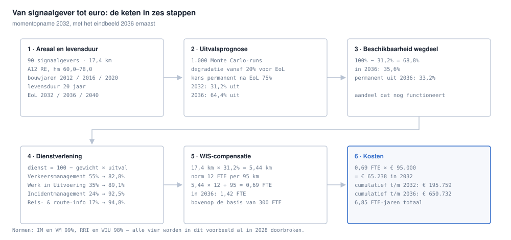
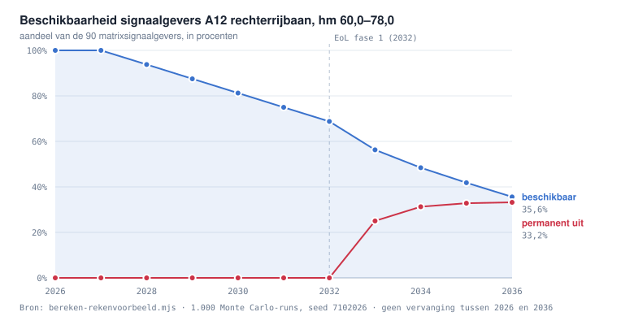
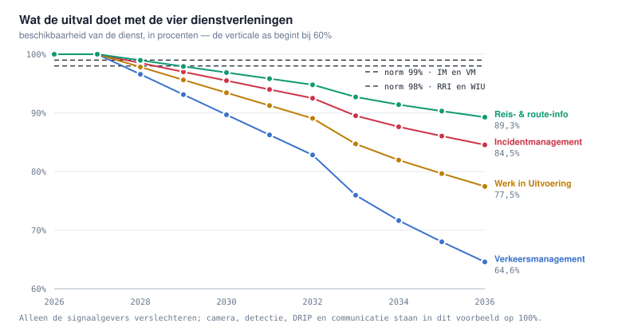
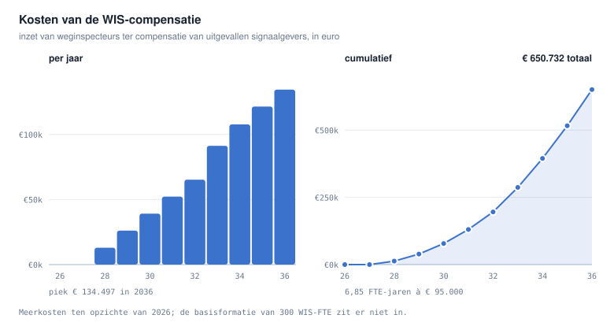

# Rekenvoorbeeld: tien jaar geen signaalgevers vervangen

Wat gebeurt er met een wegdeel, met de dienstverlening en met de kosten wanneer
de matrixsignaalgevers op een corridor tien jaar lang niet worden vervangen?
Dit voorbeeld rekent die vraag helemaal door, van bouwjaar tot euro, met de
prognosemodule die in de applicatie zelf zit
([`site/core/signal-forecast.js`](../site/core/signal-forecast.js)).

Alle getallen op deze pagina komen uit
[`scripts/bereken-rekenvoorbeeld.mjs`](scripts/bereken-rekenvoorbeeld.mjs).
Draai het script opnieuw en je krijgt exact dezelfde uitkomsten; de simulatie
gebruikt een vaste seed.

```
node docs/scripts/bereken-rekenvoorbeeld.mjs
node docs/scripts/maak-grafieken.mjs
```

---

## De corridor

Een fictieve maar realistisch opgebouwde corridor: **A12 rechterrijbaan,
hectometer 60,0 tot 78,0**, verkeerscentrale Zuidwest-Nederland. Dertig portalen
om de 600 meter, drie rijstroken breed, samen **90 matrixsignaalgevers over
17,4 kilometer**.

De corridor is in drie fases aangelegd, met een modellevensduur van twintig
jaar. Daarmee ligt het einde van de levensduur verspreid over het venster:

| Fase | Hectometer | Bouwjaar | Einde levensduur | Degradatie start |
|---|---|---|---|---|
| 1 | 60,0 – 66,0 | 2012 | 2032 | 2028 |
| 2 | 66,0 – 72,0 | 2016 | 2036 | 2032 |
| 3 | 72,0 – 78,0 | 2020 | 2040 | 2036 |

De enige aanname van dit voorbeeld is de vraag zelf: **tussen 2026 en 2036 wordt
er niets vervangen.**

De prognose gebruikt de standaardregels van de tool: duizend Monte Carlo-runs
met seed 7102026, degradatie die begint wanneer een asset nog twintig procent
van zijn levensduur te gaan heeft, en een kans van vijfenzeventig procent dat
uitval ná het einde van de levensduur permanent is.

---

## De keten in zes stappen



Elke stap is één rekenregel. Hieronder staat wat elke stap doet en wat er
uitkomt.

---

## Stap 1 en 2 · Van levensduur naar uitval

Per signaalgever bepaalt `localEolModel()` het einde van de levensduur:
een expliciet EoL-jaar als dat er is, anders bouwjaar plus levensduur. Vanaf
`onset` — het einde van de levensduur min twintig procent daarvan — loopt de
faalkans lineair op. Voorbij het EoL-jaar is elke storing met vijfenzeventig
procent kans definitief; zo'n asset komt niet meer terug.

De Monte Carlo-simulatie draait dat duizend keer en middelt het aantal
uitgevallen signaalgevers per jaar.

## Stap 3 · Beschikbaarheid van het wegdeel

De beschikbaarheid van het wegdeel is het aandeel signaalgevers dat het nog
doet. In 2026 en 2027 gebeurt er niets: de oudste fase zit dan nog vóór zijn
degradatiepunt. Vanaf 2028 loopt de uitval op met ruim zes procentpunt per jaar,
en vanaf 2033 wordt een groeiend deel daarvan onomkeerbaar.



In 2036 werkt nog **35,6 procent** van de signaalgevers, en is **33,2 procent**
permanent uitgevallen. Dat laatste getal is het belangrijkste van de hele
prognose: dat deel komt zonder vervangingsinvestering niet meer terug.

## Stap 4 · Impact op de dienstverlening

Een dienst leunt niet voor honderd procent op signalering. Hoe zwaar wel, volgt
uit de subprocessen in [`site/engines/dvm-1.js`](../site/engines/dvm-1.js): elk
subproces weegt even zwaar binnen zijn dienst, en binnen een subproces tellen de
afhankelijkheden op tot één. Optellen levert het effectieve signaleringsgewicht:

| Dienst | Norm | Gewicht van signalering | Uitval waarbij de norm breekt |
|---|---|---|---|
| Verkeersmanagement | 99,0% | 55,0% | 1,82% |
| Werk in Uitvoering | 98,0% | 35,0% | 5,71% |
| Incidentmanagement | 99,0% | 24,0% | 4,17% |
| Reis- & route-informatie | 98,0% | 16,7% | 12,00% |

Omdat in dit voorbeeld alleen de signaalgevers verslechteren — camera, detectie,
DRIP en communicatie blijven op honderd procent — geldt per dienst:

```
dienstbeschikbaarheid = 100 − signaleringsgewicht × uitvalspercentage
```



Het beeld is scheef, en dat is precies de bedoeling van de weging.
**Verkeersmanagement** leunt voor 55 procent op de matrixsignaalgevers en zakt
daarom van 100 naar 64,6 procent — het verliest bijna net zoveel als het areaal
zelf. **Reis- en route-informatie** leunt vooral op detectie en DRIP en houdt
89,3 procent over.

De eerste zes procent uitval in 2028 is meteen genoeg om drie van de vier normen
te breken: verkeersmanagement, incidentmanagement en werk in uitvoering gaan er
in 2028 doorheen, reis- en route-informatie volgt in 2029. Normen van 98 en 99
procent laten nu eenmaal weinig ruimte.

## Stap 5 en 6 · WIS-compensatie en wat die kost

Wat een uitgevallen signaalgever niet meer doet, moet een mens doen. De tool
rekent die compensatie in weginspecteurs: **twaalf WIS-FTE per 95 kilometer**
aangetast wegdeel, tegen **€ 95.000 per FTE per jaar**.

```
aangetast wegdeel = routelengte × uitvalspercentage
WIS-FTE           = aangetast wegdeel × 12 / 95
kosten            = WIS-FTE × € 95.000
```

Die kosten zijn **meerkosten ten opzichte van het referentiejaar 2026**. De
basisformatie van 300 WIS-FTE dekt de situatie van 2026 al; wat de prognose
uitrekent is wat daar bovenop komt.



Over het hele venster kost het niet-vervangen van deze ene corridor
**€ 650.732 aan extra weginspectiecapaciteit**, samen **6,85 FTE-jaren**. In het
laatste jaar alleen al is dat € 134.497 — en dat bedrag stopt niet in 2036, want
de tweede en derde aanlegfase zijn dan pas net aan hun degradatie begonnen.

---

## Alle uitkomsten

| Jaar | Uitval | Beschikbaar | Permanent uit | Aangetast | WIS-FTE | Kosten | Cumulatief | IM | VM | RRI | WIU |
|---|---|---|---|---|---|---|---|---|---|---|---|
| 2026 | 0,00% | 100,00% | 0,00% | 0,00 km | 0,00 | € 0 | € 0 | 100,00% | 100,00% | 100,00% | 100,00% |
| 2027 | 0,00% | 100,00% | 0,00% | 0,00 km | 0,00 | € 0 | € 0 | 100,00% | 100,00% | 100,00% | 100,00% |
| 2028 | 6,22% | 93,78% | 0,00% | 1,08 km | 0,14 | € 12.980 | € 12.980 | 98,51% | 96,58% | 98,96% | 97,82% |
| 2029 | 12,51% | 87,49% | 0,00% | 2,18 km | 0,27 | € 26.114 | € 39.094 | 97,00% | 93,12% | 97,92% | 95,62% |
| 2030 | 18,76% | 81,24% | 0,00% | 3,27 km | 0,41 | € 39.180 | € 78.274 | 95,50% | 89,68% | 96,87% | 93,43% |
| 2031 | 25,02% | 74,98% | 0,00% | 4,35 km | 0,55 | € 52.246 | € 130.521 | 93,99% | 86,24% | 95,83% | 91,24% |
| 2032 | 31,24% | 68,76% | 0,00% | 5,44 km | 0,69 | € 65.238 | € 195.759 | 92,50% | 82,82% | 94,79% | 89,06% |
| 2033 | 43,72% | 56,28% | 25,02% | 7,61 km | 0,96 | € 91.290 | € 287.049 | 89,51% | 75,95% | 92,71% | 84,70% |
| 2034 | 51,58% | 48,42% | 31,27% | 8,98 km | 1,13 | € 107.704 | € 394.753 | 87,62% | 71,63% | 91,40% | 81,95% |
| 2035 | 58,18% | 41,82% | 32,82% | 10,12 km | 1,28 | € 121.482 | € 516.235 | 86,04% | 68,00% | 90,30% | 79,64% |
| 2036 | 64,41% | 35,59% | 33,20% | 11,21 km | 1,42 | € 134.497 | € 650.732 | 84,54% | 64,57% | 89,26% | 77,45% |

De machineleesbare versie staat in
[`rekenvoorbeeld.json`](rekenvoorbeeld.json).

---

## Welk signaal dit oplevert

`buildForecastTriggers()` toetst de prognose aan drie landelijke grenzen. Voor
deze ene corridor slaat er één aan:

> **ROOD · Permanente signaalgeveruitval boven grens** — aan het einde van 2036
> is de verwachte cumulatieve permanente uitval 33,2% van het MSI-areaal.
> Regel: cumulatieve permanente MSI-uitval ≥ 10%. Verantwoordelijk:
> assetmanagement DVM.

De twee andere grenzen — vijf procent extra WIS-FTE boven de basisformatie, en
één miljoen euro aan jaarlijkse meerkosten — blijven onder de drempel, en dat
hoort ook zo. Die drempels zijn landelijk bedoeld; 1,42 FTE van één corridor van
17 kilometer haalt ze terecht niet. Het permanente-uitvalsignaal is hier het
signaal dat telt.

---

## Wat dit voorbeeld niet zegt

**Het is een prognose, geen meting.** De uitvalspercentages komen uit een
kansmodel op basis van bouwjaar en levensduur, niet uit waargenomen storingen.
In de draaiende applicatie wordt de dienstbeschikbaarheid berekend uit de
werkelijk geladen open storingen; de prognose voedt het signalenregister, niet
die berekening. De vertaling van uitval naar dienstverlening op deze pagina
gebruikt wel de eigen subprocesgewichten van de engine, maar is een afleiding
die hoort bij dit voorbeeld.

**De verkeerskosten zitten er niet in.** BiDash rekent verkeersschade apart uit,
via voertuigverliesuren en tarieven per wegdeel. Die bedragen worden bewust niet
bij de WIS-kosten opgeteld: het zijn twee verschillende soorten geld met twee
verschillende eigenaren. Wie een totaalplaatje wil, zet ze naast elkaar en niet
onder elkaar.

**Een tekort is geen besluit.** Dat verkeersmanagement in 2032 op 82,8 procent
staat tegen een norm van 99 procent betekent dat de norm niet gehaald wordt —
niet dat er automatisch 0,69 FTE bij moet, of dat vervanging de goedkoopste
oplossing is. Die afweging blijft van de dienstverantwoordelijke.

**De corridor is verzonnen.** Bouwjaren, hectometrering en portaalafstanden zijn
plausibel gekozen om de rekenregels te tonen. Vervang ze door je eigen
assetregister en het script rekent het echte areaal door.
